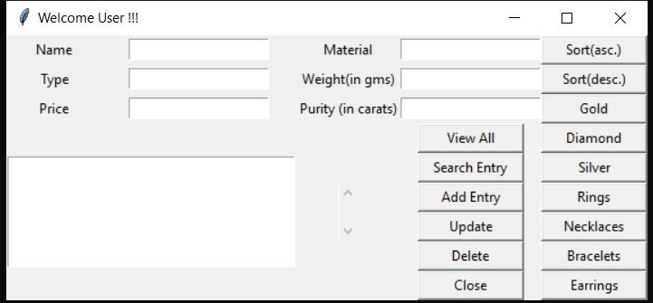

# jwl-crud-py
A CRUD GUI based application that uses Python and SQL
This is a jewellry management application that uses the Tkinter package for the frontend and sqlite3 for the backend SQL. It offers the basic Add, Update, Delete and Search functionalities.
Also it offers extra functionalities in the form of hotkeys that return the co-responding queries as indicated on their button labels.

